##Advance Lane Detection and Tracking

This is project done as a part of Udacity Slef driving car engineer nano degree (https://www.udacity.com/drive)

---

**Advanced Lane Finding Project**

The goals / steps of this project are the following:

* Compute the camera calibration matrix and distortion coefficients given a set of chessboard images.
* Apply a distortion correction to raw images.
* Use color transforms, gradients, etc., to create a thresholded binary image.
* Apply a perspective transform to rectify binary image ("birds-eye view").
* Detect lane pixels and fit to find the lane boundary.
* Determine the curvature of the lane and vehicle position with respect to center.
* Warp the detected lane boundaries back onto the original image.
* Output visual display of the lane boundaries and numerical estimation of lane curvature and vehicle position.

## Calibration
The test images of the checker boards are used to calibrate the camera and get the **distortion cofficeints** and **camera matrix**. The below images clearly show the distortion correction based on the camera parameters.

distorted                                      |              undistorted                         
---------------------------------------------- | ----------------------------------------------
            | 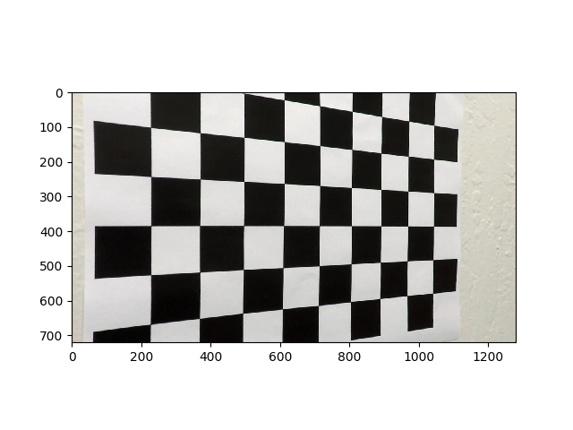 
                 | 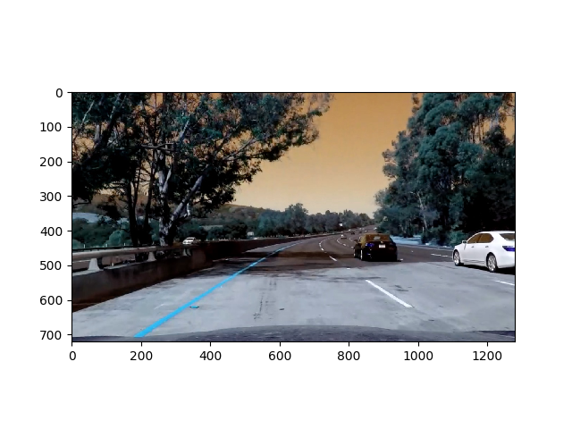 

run `python calibrateCamera.py camera_cal/calibration test_images/straight_lines1.jpg 9 6`         
this should compute the camera matrix and distoration cofficients and save them as a pcikle file
 *cameraCalibrationParams.pickle*
 
## Theresholding  
 
Used the following approach for thresholding, Threshold with x gradient for greyscale image and Threshold with colour S channel and then combine the two binary thresholds to generate a binary image.
Below plot shows the thresholded images

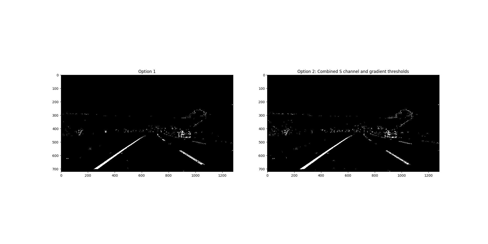

The thresholding technique used is shown on all the test images below:

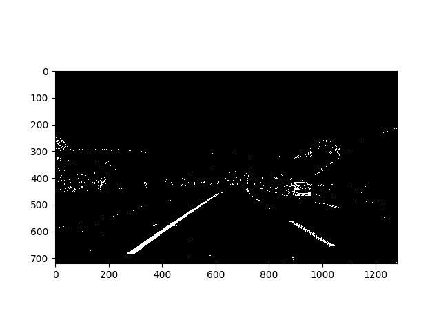
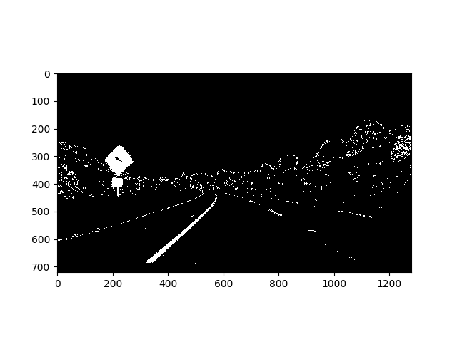
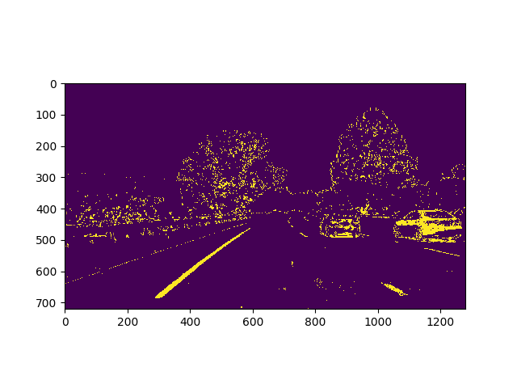
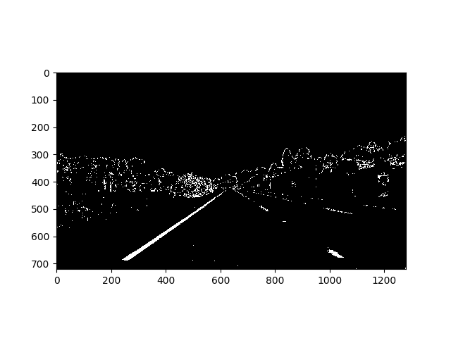
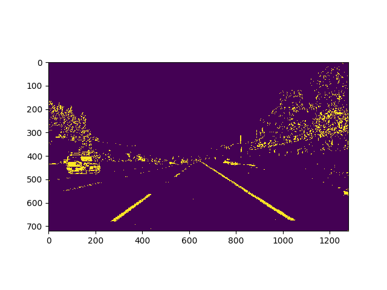

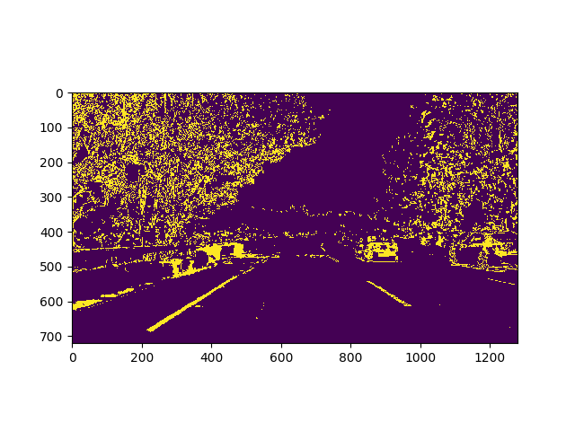
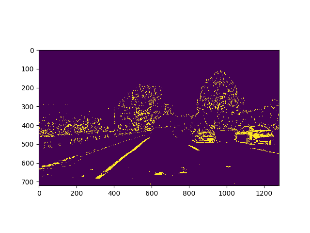

**note: additional info**
Different thresholding techniques can be seen on a single image below (absSobel threshold, magnitude threshold, direction threshold, HLS threshold respectively)
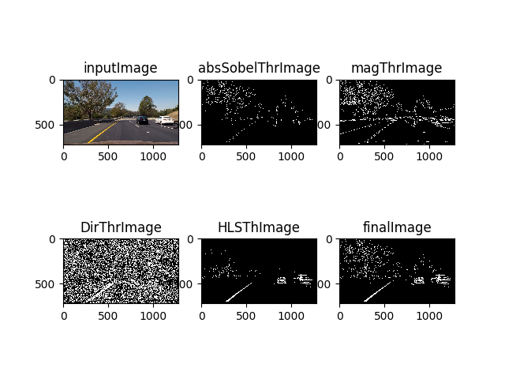

These can be acheived by `python testThreshold.py`     

## Perspective transform

The idea is to transform the image from camera perspective to the bird eye view perspective. We obtain the transformation matroix using `cv2.getPerspective` and tranform using `cv2.warpPerspective`.
Below images shows this.

before transformation                             |              after transformation 
------------------------------------------------  | ------------------------------------------------
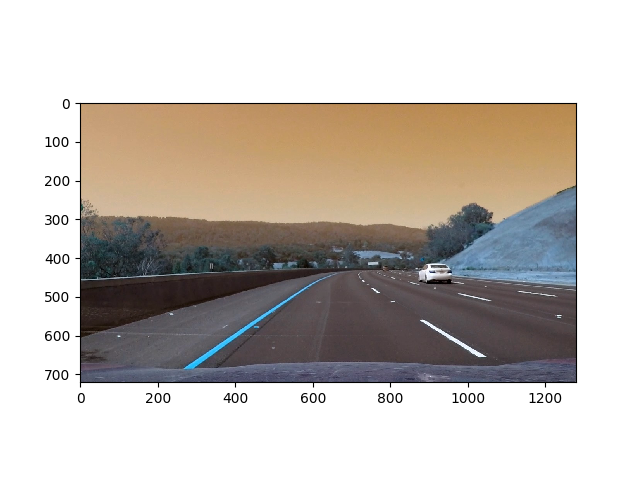      | 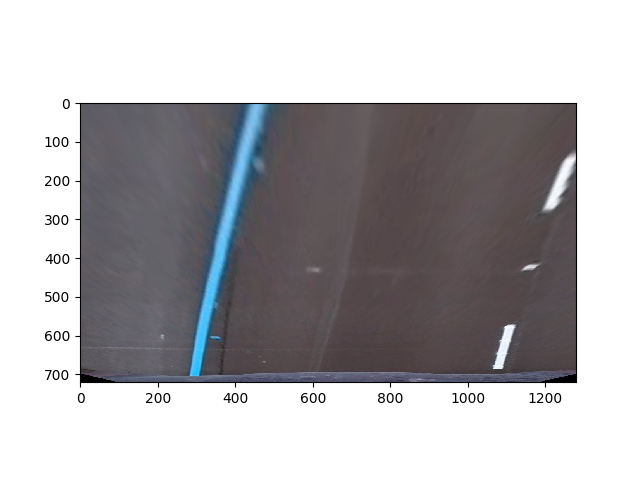 

This can be achieved by using `python testPerspectiveTransform.py`    

perspective correction shown on straight line images in test_images:

before transformation                             |              after transformation 
------------------------------------------------  | ------------------------------------------------
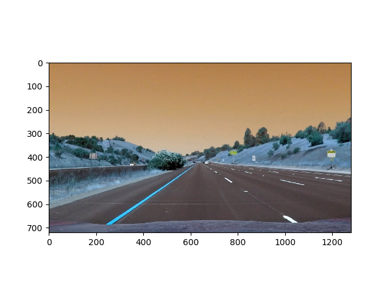  | 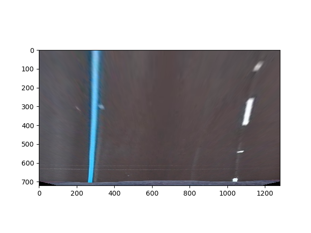 
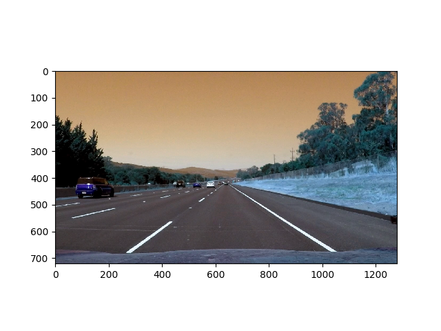  | 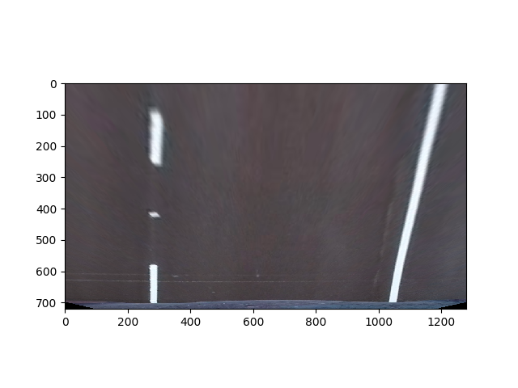 

## Lane detecetion and Line fitting

The idea to detect the lane is to divide the image into steps of equal height. For each step, get the pixels at each x-value with histogram and find the peaks in the left and right halves which will give the lanes and then a second order polynomial is used to fit the line across these lanes.
Below images show the approach
All the below images are shown after transfomation to bird eye view
showing the pixels for both left and right lanes

left                                                 | right
---------------------------------------------------- | ----------------------------------------------------
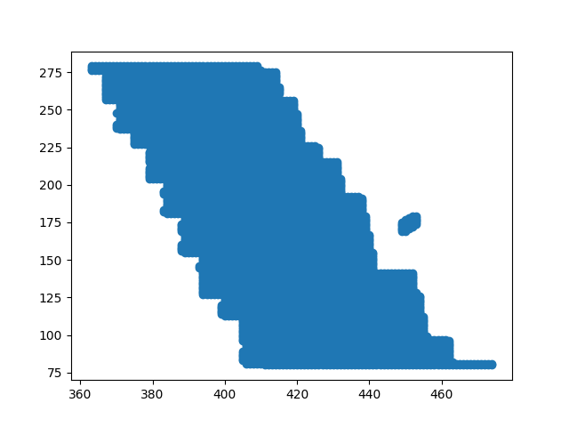    | 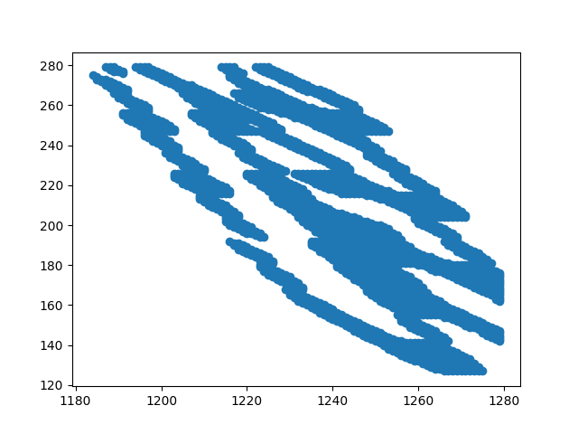

showing the histogram of left and right lanes

raw histogram                                        | smoothened
---------------------------------------------------- | ----------------------------------------------------
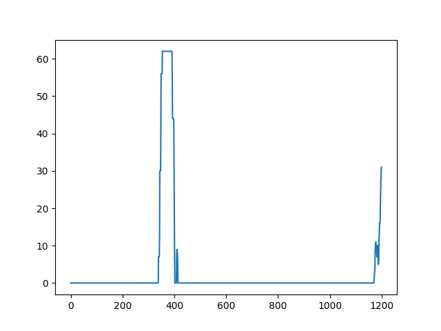       | 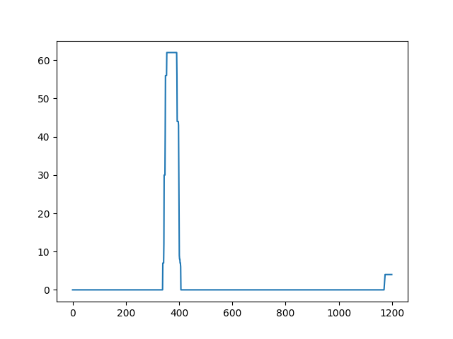

fitting a line across the lane                        

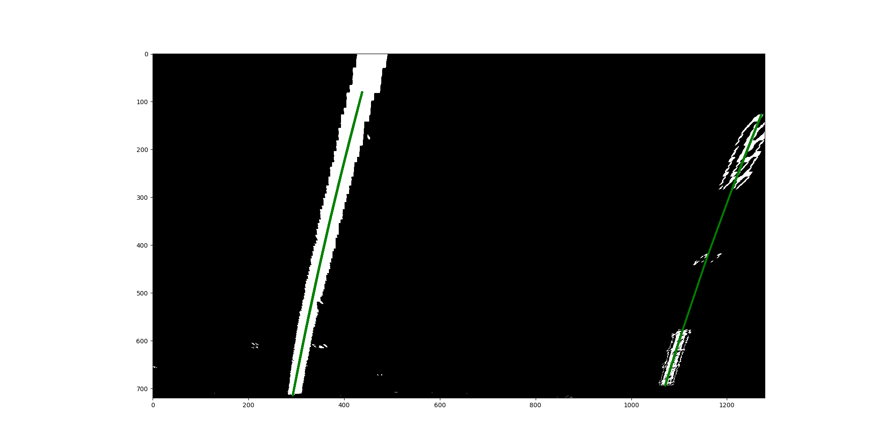

drawing the line across the lane                        

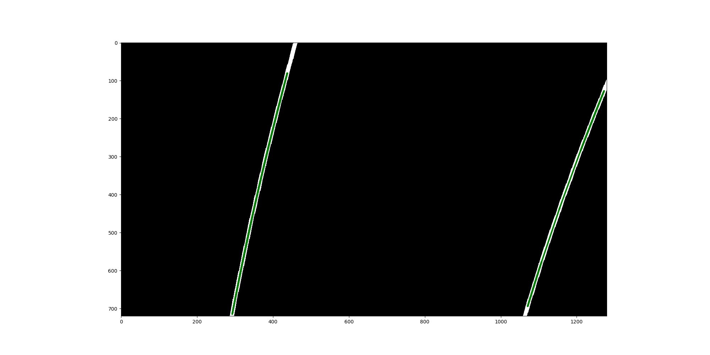

Then the trace of the lane is highlighted as shown below:                       

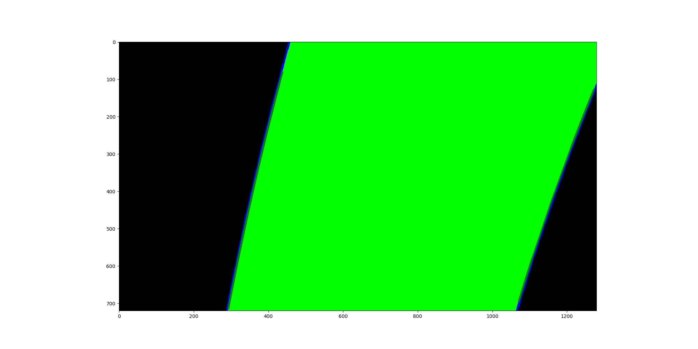

## Lane Position and Radius of Curvature
curvature is found using `np.absolute(((1 + (2 * left_coeffs[0] * y_eval + left_coeffs[1])**2) ** 1.5)/(2 * left_coeffs[0]))` in *imagePipeLine.py*

## Wrap back
The trace is written on top of the image and wrapped back
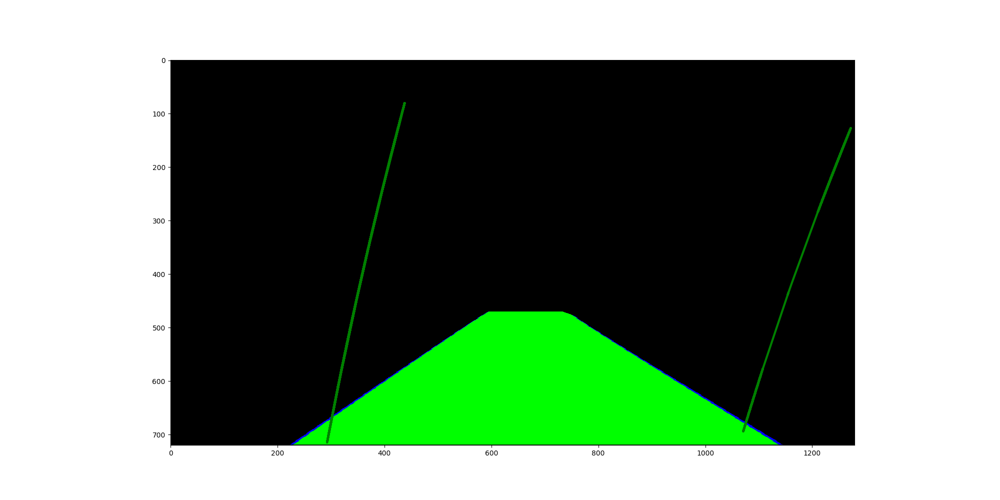

The text is writtena on top of the image
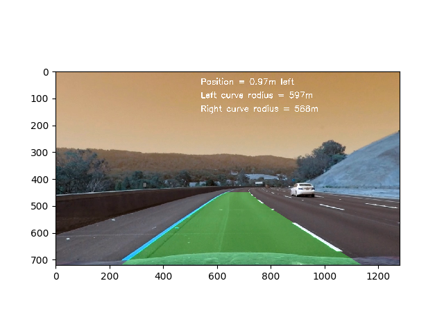

## Image pipeline

As mentioned above, first the image is corrected for distortion, then perspective transformation to bird eye is appalied and the image is then thresholded. On which the lanes are detcted and a 2nd order polynomial is used to fit a line through the lanes, then the curvature and position from center is determined. this data is written on top of the image and finally the image wrapped back to camera perspective.

Below images show the steps:

input image                                                              

perspective changed                
 

thresholded image                       

lane detection                                                           
 

line fitting using 2nd order polynomial                                          
 

draw the ine across lanes                    
                            

trace of the lane                
 

transform back to the camera perspective
 

final image

## Final output

The video is avialbel here on [youtube](https://www.youtube.com/watch?v=he3RUaivvJc&feature=youtu.be)

## Running the code
run `python main.py`      
this should generate the output, change the paths if required.

## Discussion

This is the first shot implementation of lane detection and tracking, which can fail in multpile scenarios like when the disturbances on the road can be treated as lane, light conditions can effect the detection etc.
Also Noise in detection of lanes cause to detect higher cruvature, some times lane are not detected (play with the thresholds of gradient and S).
Possible solution for this would be to use deep learning techniques for semantic segmentation to detect the pixels with porbability of lane and then detect the lane and fit a line acroos the lane.

