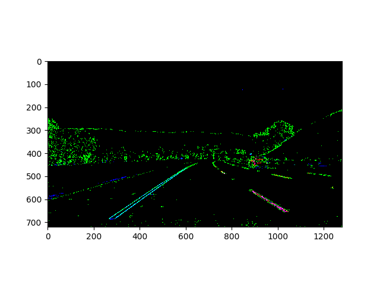

##Advance Lane Detection and Tracking

This is project done as a part of Udacity Slef driving car engineer nano degree (https://www.udacity.com/drive)

---

**Advanced Lane Finding Project**

The goals / steps of this project are the following:

* Compute the camera calibration matrix and distortion coefficients given a set of chessboard images.
* Apply a distortion correction to raw images.
* Use color transforms, gradients, etc., to create a thresholded binary image.
* Apply a perspective transform to rectify binary image ("birds-eye view").
* Detect lane pixels and fit to find the lane boundary.
* Determine the curvature of the lane and vehicle position with respect to center.
* Warp the detected lane boundaries back onto the original image.
* Output visual display of the lane boundaries and numerical estimation of lane curvature and vehicle position.

## Camera Calibration
The test images of the checker boards are used to calibrate the camera and get the **distortion cofficeints** and **camera matrix**. `cv2.findChessboardCorners` is used to detect the checker boards and `cv2.calibrateCamera` is used to calibrate the camera and `cv2.undistort` is used to undotort the image based on the camera settings.
The code is available in `calibrateCamera.py`.

ForThe below images clearly show the distortion correction based on the camera parameters.

distorted                                      |              undistorted                         
---------------------------------------------- | ----------------------------------------------
          |  
       |  

run `python calibrateCamera.py camera_cal/calibration test_images/straight_lines1.jpg 9 6`         
this should compute the camera matrix and distoration cofficients and save them as a pcikle file
 *cameraCalibrationParams.pickle*
 
run `python testCameraCalibration.py` to generate these test images
 
## Theresholding  
 
For thresholding I use three combined approaches: 
* Sobel gradient threshold in the horizontal (x) direction, implemented in function `SobelX()`
* HLS threshold in the S-plane, implemeneted in function `HlsGrad()`
* RGB thresholds around yellow and white colors.implemented in  function `ColorFilt`

In below composite image, Red pixels are represent the yellow or white RGB thresholding, green pixels represents the Sobel gradient thresholding, and blue pixels represent HLS thresholding. 
The relevant code is available in *threshold.py* and the test images can be obtained by running `python testThreshold.py`

The thresholding technique used is shown on the test images below:

## Perspective transform

The idea is to transform the image from camera perspective to the bird eye view perspective. we use `cv2.getPerspectiveTransform` to get the wrap matrix from the wrap polygon and tranform using `cv2.warpPerspective` and the co ordinates for the wrap polygon are obtained from trail and error and decided whihc can be seen in function `warp_and_unwarp_params()`, the wrap can be achived by function `warp()` in file *perspectiveTransofmration.py*
perspective correction shown on straight line images in test_images:

before transformation                             |              after transformation 
------------------------------------------------  | ------------------------------------------------
  |  
  |  

This can be achieved by using `python testPerspectiveTransform.py`    

## Lane detecetion and Line fitting

I created a histogram of the binary image column-wise, for the bottom half of the image, for the initial search, left and right lanes start anywhere in the left-half and righ-half of the image, respectively. For subsequent images, search is only done within a neighborhood of the last frame. whihc preventes the lane lines from jumping with false positives

The above approach is implemented in `find_lines()` in file *laneFinder.py*

Once the lane is found then a line is fitted accross the lane using `np.polyfit()` as in the class this can be seen in `draw_lines()` in file *line.py*.

The image below shows where the side barrier detected in the warped image, but the lane lines are correctly identified.

Input image

fitting a line across the lane                        

## Lane Position and Radius of Curvature

Car position in the lane is measured by calculating the difference between the distance from center of image to left line and the distance from center of image to right line. Which is then converted from pixels to meters, gives the relative position within the lane. 0 means the car is centered. 

This approach is implemented in `position()` in file *line.py*

Fro radius I used the code from the lesson, `self.radii[0] = ((1 + (2*left_fit_cr[0]*y_eval*ym_per_pix + left_fit_cr[1])**2)**1.5) / np.absolute(2*left_fit_cr[0])` in `draw_lines()` file *line.py*

## Wrap back
The trace is written on top of the image and wrapped back

The text is writtena on top of the image

## Image pipeline

As mentioned above, first the image is corrected for distortion, then thresholded, then perspective transformation to bird eye is appalied. On which the lanes are detcted and a polynomial is used to fit a line through the lanes, then the curvature and position from center is determined. this data is written on top of the image and finally the image wrapped back to camera perspective.

Below images show the steps:

input image                                                              

distortion corrected               
 

 thresholded image                      

perspective transformation                                                          
 

detect lanes and fit a line                                       
 

draw the trace                 
                            

transform back to the camera perspective               
 

annotate and paint the lanes
 

## Final output

 

The video is avialbel here on [youtube](https://www.youtube.com/watch?v=QqeRckiXBss&feature=youtu.be)

## Running the code
run `python main.py`      
this should generate the output, change the paths if required.

## Discussion

This is the first shot implementation of lane detection and tracking, which can fail in multpile scenarios like when the disturbances on the road can be treated as lane, light conditions can effect the detection etc.
Also Noise in detection of lanes cause to detect higher cruvature, some times lane are not detected (play with the thresholds of gradient and S).
Possible solution for this would be to use deep learning techniques for semantic segmentation to detect the pixels with porbability of lane and then detect the lane and fit a line acroos the lane.

